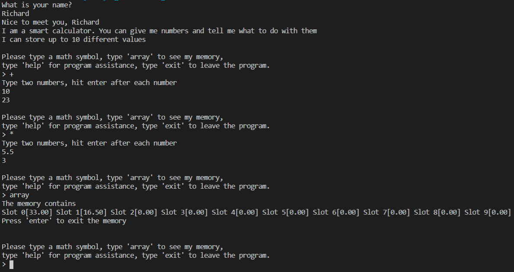

# Overview
A calculator that can process a variety of 2-variable equations. It takes the answers of those equations and stores them in memory so the user can view them and use those numbers in future equations Created with Java, Visual Studio Code, and Github/GIT

# Developement Enviroment

* Visual Studio Code
* Java 8

# Execution

To run the program: Type 'javac hotAndCold.java' to compile and then 'java hotAndCold' to run. Or, you can simply click the play button in VS Code

# Useful Information

[Java documentation](https://docs.oracle.com/javase/tutorial/)
[Helpful Java website](https://www.w3schools.com/java/default.asp)